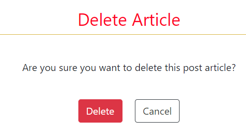

# News Mix Website (Milestone Project 4)

[News Mix](https://thenews-527458e708d0.herokuapp.com/) is an online news reporter and social advocates dedicated to bringing you news and happening around the globe from African perspective.

## Table of contents

- [News Mix](#news-mix)
  - [Table of contents](#table-of-contents)
  - [Purpose](#purpose)
- [UX Design](#ux-design)
  - [User stories](#user-stories)
    - [As a **first time user**](#as-a-first-time-user)
    - [As a **returning user**](#as-a-returning-user)
  - [UAC](#uac)
    - [Home Page](#home-page)
    - [Sign Up Page](#sign-up-page)
    - [Sign In Page](#sign-in-page)
      - [User Goal](#user-goal)
      - [Website Goal](#website-goal)
    - [Posts Page](#posts-page)
      - [User Goal](#user-goal-1)
      - [Website Goal](#website-goal-1)
    - [Post Detail Page](#post-detail-page)
    - [Create/Update Post Page](#createupdate-post-page)
    - [Delete Post Page](#delete-post-page)
      - [User Goal](#user-goal-2)
      - [Website Goal](#website-goal-2)
- [Development Plan](#development-plan)
  - [Agile design](#agile-design)
- [Design](#design)
  - [Design](#design-1)
    - [Colour Scheme](#colour-scheme)
- [Features](#features)
  - [Auth (uac 1)](#auth-uac-1)
    - [User Authentication (uac 6)](#user-authentication-uac-6)
    - [Reset password (uac 18)](#reset-password-uac-18)
  - [Responsive (uac 1)](#responsive-uac-1)
  - [Accessibility](#accessibility)
    - [Navbar (uac 3, uac 4)](#navbar-uac-3-uac-4)
    - [Comment field (uac 16)](#comment-field-uac-16)
  - [Admin (uac 5)](#admin-uac-5)
  - [Content Moderation (uac 15)](#content-moderation-uac-15)
  - [JS Bundling](#js-bundling)
  - [**Feature considerations**](#feature-considerations)
- [Testing](#testing)
  - [User Story Testing](#user-story-testing)
    - [Blog Host](#blog-host)
- [Deployment](#deployment)
    - [First step](#first-step)
      - [Step 2 Database](#step-2-database)
      - [Step 3](#step-3)
      - [Step 4](#step-4)
      - [Step 5](#step-5)
    - [Second step](#second-step)

## Purpose

News Mix website is built using Django framework, which provides the backend functionality, such as user authentication, data management, and routing which handles the majority of the frontend. The website combines the power and flexibility of Django to deliver a smooth and responsive user experience.

News Mix is a database-backed Django app for News and happenings around the world. The website is created with Design Thinking and Agile approch putting myself in users position.
User story was created as a guideline in adding the blog functionality

The website provides all the essential features, such as creating a personal account, searching and filtering posts, the ability to add and manage posts, commenting on posts liking and unlike any post.

The website was developed as a Milestone Project#4 for the Code Institute's Full Stack Developer course.

The live link to News Mix webpage can be found here - <https://thenews-527458e708d0.herokuapp.com/>

# UX Design

## User stories

Target audiences:

- Aged 45 and above who are not too convansent with social media. (U)
- Individuals who are interested in reading news and happenings around the world (I)

### As a **first time user**

- I want to be able to access the website from any device.
- I want to easily understand the main purpose of the site and learn more about the topic.
- I want to be able to easily navigate and find content.
- I want to create my personal account to see posts.
- I want to create an account fast, but I want it to be secure.
- I want to easily access a category of posts I need and to be able to search through them.
- I want to open a post on a separate page to see all the details.
- I want to be able to create a post myself.

### As a **returning user**

- I want to be sure my data is protected.
-
- I want the server to recognise my device so I can login without entering my information again
-
- I want to access comments from any post on the website.

- I want to be able to access the navbar.

- I want posts to be paginated so it helps me remember on what page I saw something interesting or stay on the same page if I accidentally refresh the page or there are problems with the internet connection.

- I want to be able to report comments that I find offensive, unsafe or inappropriate.

- I want the comments to be moderated, so I don't need to report it.

- I want to be able to write comments to give my opinion on any news

- I want to be able to update and delete my posts.

- I want to be able to reset my password if I forget it.

## UAC

User Acceptance Criteria based on the user stories:

1. The website should be fully responsive and accessible on any device, including desktop, tablet, and mobile.

2. The website should have a clear and concise homepage that display news.

3. The website should have a clear and intuitive navigation menu that allows users to easily find and access the content.

4. The website should have a registration form that allows users to create a personal account.

5. The website should have admin panel.

6. The registration process should be fast and easy, but also secure, using encryption and other security measures.

7. Each post should have a link that allows users to view it on a separate page, where they can see all the details and information about the post.

8. The website should have a form that allows registered users to create their own posts.

9. Each post should have name of author that allows users know who publish news.

10. Each post should display date and time of publication to allow users know most current news.

11. The website should have a user profile page that displays information about other users to allow other users know who wrote a particular comment.

12. The website should have links to its social media pages, such as Facebook, Twitter, Instagram, etc.

13. The website should have security measures in place to protect user data, such as encryption and secure servers.

14. The website should divide the posts into pages so that users can easily navigate through them.

15. The website should have a moderation system that reviews and approves or removes content that does not meet the standards of the website.

16. The website should allow registered users to leave comments on posts, in order to share their opinion.

17. The website should allow registered users to edit and delete their own posts, if they need to.

18. The website should have a password reset feature that allows registered users to reset their password in case they forget it.

19. The website should provide feedback about the status of the processes.

20. The website should footer.

### Home Page

- Displays the main purpose and topic of the site.
- Addresses questions and doubts the first-time users might have and provides a registration form.
- Presents opportunities for possible further actions

    #### User Goal

    > -  Understand the main purpose of the website.
    > -  Be able to signing up/in.
    > -  Easily navigate and interact with the website.
    > -  Access social media.

    #### Website Goal

    > - Inform the user about the main purpose.
    > - Engage the user.
    > - Call to action.
    > - Initiate future engagement, such as following on social media.
    > - Provide aesthetically pleasing user experience.

### Sign Up Page

- Allows user to sign up.

    #### User Goal

    > - Sign up.

    #### Website Goal

    >  - Allow the user to sign up easily.
    >  - Provide aesthetically pleasing user experience.

### Sign In Page

- Allows to sign in

#### User Goal

  > - Sign in.

#### Website Goal

  > - Allow the user to sign in easily.
  > - Provide aesthetically pleasing user experience.

### Posts Page

- Shows posts.
- Allows users to easily find and access posts.
- Allows opening each post on a separate page.
- Available only for all users.

#### User Goal

  > - Browse the posts.
  > - Easily find and access specific categories of posts
  > - Open posts to see them in detail.

#### Website Goal

  > - Provide a list of posts.
  > - Provide comprehensive information on each post in a preview.
  > - Provide aesthetically pleasing user experience.

### Post Detail Page

- Shows a post in detail including an image.
- Allows to see and write comments about the post.
- Allows like and dislike post.
- Allows see the author name and published date.
- Allows you to manage the post if you are the author.
- Available only for authenticated users.

- #### User Goal

  > - See a post in detail.
  > - See comments other users left about the post.
  > - Leave your comments.
  > - Manage the post, if you are the author.

- #### Website Goal

  > - Show a post in detail.
  > - Allow the user to interact with the post.
  > - Provide aesthetically pleasing user experience.

### Create/Update Post Page

- Creates a new post.
- Allows updating an existing post.
- Allows deleting a post.
- Available only for authenticated users.

- #### User Goal

  > - Create a new post.
  > - Update your posts.

- #### Website Goal

  > - Allow the user to create/update a post.
  > - Provide aesthetically pleasing user experience.

### Delete Post Page

- Confirms if the user wants to delete their post.
- Available only for authenticated users.

#### User Goal

  > - Delete a post.

#### Website Goal

  > - Confirm with the user deletion of the post.
  > - Provide aesthetically pleasing user experience.

### Footer ([uac 11](#uac11), [uac 12](#uac12), [uac 20](#uac20))

The website's footer is designed to provide users with useful such as privacy policy which are important for users to be aware of as well social media link for users to follow and get more news update easy and faster.

# Development Plan

## Agile design

The development of the website has followed an Agile methodology, using GitHub's projects to prioritize and track user stories and features. The approach enabled the implementation of ideas based on their level of importance, ensuring that the website functionality and user experience were not compromised. The following categories were applied

- must have
- should have
- would have
- could have

# Design

## Design

The website is meant to have a simple layout and a clean design. The home page is aimed at giving a professional and informative impression.

### Colour Scheme

The colour scheme is red and white to create a visually appealing and cohesive design that is easily recognizable as being associated to news website.

# Features

## Auth ([uac 1](#uac1))

Authentication is particularly important for user for wants to interact with posts as the subject is quite sensitive and people are vulnerable asking for help, so it should be confidential within the community and available only for authenticated users. Thus the website, besides the home page is a registration link for users to register

In a Django project, there are several ways to handle authentication and authorization. One of the most popular libraries [django-allauth](https://django-allauth.readthedocs.io/en/latest/), provides a flexible solution for handling user authentication and registration. It supports both traditional username and password authentication as well as social authentication through providers like Google, Facebook, and Twitter. It uses session-based authentication and stores user authentication information in the user's session, instead of Django's built-in token-based authentication. When a user logs in, the library creates a new session for the user and stores the user's identifying information (such as the user's ID or username) in the session. The library then sends a session ID to the client, as a session cookie, which the client stores in the browser. With each subsequent request, the client sends the session ID back to the server in the Cookie header of the HTTP request. django-allauth then uses the session ID to look up the associated session and authenticate the user.

One of the key features of [django-allauth](https://django-allauth.readthedocs.io/en/latest/) is its support for OAuth. OAuth is an open standard for authorization that allows users to share their private resources stored on one site with another site, without having to share their credentials. OAuth allows users to grant a third-party application access to their resources without having to reveal their password. This is useful for scenarios where users want to give access to their resources to a third-party application without having to provide their credentials.

One of the main reasons I chose to use [django-allauth](https://django-allauth.readthedocs.io/en/latest/) is because of its flexibility and support for various authentication methods. Another reason is because of its scalability. The library is built on top of the Django framework and it is actively maintained and widely used in production, which means that it is likely to be compatible with the latest Django versions and have a solid user base.

### User Authentication ([uac 6](#uac6))

The project uses Django's built-in User model, which means that users can register and log in to the website with email, username. However, users will not be logged in automatically after resetting their password. The ACCOUNT_SESSION_REMEMBER is set to True which means that the session will be remembered even if the user closes the browser.

### Reset password ([uac 18](#uac18))

The website also provides a password reset feature, which is an important security feature that allows users to reset their password if they have forgotten it or if their account has been compromised.

## Responsive ([uac 1](#uac1))

News Mix website is designed with flexibility and aesthetic appeal in mind, ensuring that it is responsive and visually pleasing on all screen sizes and resolutions, starting at 350px.
Responsiveness was achieved by utilizing Bootstrap. This allowed for the rearrangement of page components to optimize the user experience on different screen sizes. Breakpoints were chosen based on typical device screen sizes and the goal of providing the best possible presentation of content for all screens. Breakpoints are not strictly consistent (\*particularly for smaller screens) but it is done intentionally to provide a better presentation of the content for all screens.

## Accessibility

The website is designed and developed with accessibility in mind: it provides alternative text for images, using semantic HTML elements, aria-labels and providing adequate colour contrast. Keyboard navigation is possible. It also works with screen readers, however, there's room for improvement in this aspect, to ensure that it is fully accessible to users with disabilities.

### Navbar ([uac 3](#uac3), [uac 4](#uac4))

The navbar is a key feature of the website, located at the top of the page. It also include links that aid navigation on the website. The "Registration" link provides form for new users to register and the login allows already registered users to login. The "Login" and "Register" links are used for user authentication and are only visible to unauthenticated users. Once the user logs in, they will not see these links anymore and "Log out" will be displayed instead.

### Comment field ([uac 16](#uac16))

The form to leave a comment appears when the user opens post to read news details. It is handled by JavaScript without refreshing the page. This allows for a seamless and smooth user experience, as users can leave comments without disrupting their current browsing session.

It is important to note that all comments are moderated to ensure that the content is appropriate and relevant to the post. This helps to maintain a positive and respectful community and ensures that all users have a positive experience while using the website.

## Admin ([uac 5](#uac5))

The website includes a fully customised Admin panel. The admin panel allows for the management and editing of the application's data through a web interface. This interface is only accessible to users with administrator or superuser privileges. The admin panel provides CRUD functionalities. It allows for the management of the content, users, groups, and permissions.

## Content Moderation ([uac 15](#uac15))

Content moderation is essential to ensure that the content is appropriate and does not violate any terms of service or community guidelines, protecting against spam or malicious content, and maintaining a positive user experience. In my project, content moderation is done for all posts and comments left on posts and is implemented by the admin users who have access to the admin panel where they can review and approve or reject comments. This helps to ensure that all the content is relevant, respectful and appropriate for the community.

## JS Bundling

JavaScript bundling is an optimization technique we can use to reduce the number of server requests for JavaScript files. Webpack is a JavaScript bundler that allows to package and optimize JavaScript code for production use. It takes multiple JavaScript files, and any other assets such as images or CSS, and creates a single bundle that can be loaded by the browser. This bundle includes all the code your application needs to run, and it can also optimize the code for faster load times and better performance.

In the project before bundling the code was compiled with Babel, a JavaScript transpiler that allows to write modern JS code and then converting it to a version that is compatible with older browsers. For this reason, the main JS file that handles Django app was also bundled.

## **Feature considerations**

1. Reply comment section so that users can interact with each other and engange more on the post.

2. Deleting comment and editing comment so users can leave only what they want to be on a post.

3. Translation, so that users can translate to their prefared language.

4. Reporting undesirable content.
Buttons for reporting undesirable content on a website will allow users to quickly and easily flag content that they believe is inappropriate, offensive, or violative of the website's terms of service. This allows website administrators to quickly identify and remove such content, keeping the website safe and enjoyable for all users. Additionally, reporting buttons can help to create a sense of community and shared responsibility among users, encouraging them to take an active role in maintaining the website's standards and quality.

5. Buttons to share posts on social media.
Buttons that provide the ability for users to share content on social media allow for an increase in the reach and visibility of the content. This can lead to more traffic to the website and ultimately more engagement. The buttons make it easy for users to share content with their friends and followers on social media.
When content is shared on social media, it includes a link back to the website. This can help with branding, as it increases the visibility of the website and its content, increasing positive impact.

# Testing

## User Story Testing

| Expectations                                                                                 | Realisation                                                                                                                                                                                                                                                                                                                                                                                                                          |
|----------------------------------------------------------------------------------------------|--------------------------------------------------------------------------------------------------------------------------------------------------------------------------------------------------------------------------------------------------------------------------------------------------------------------------------------------------------------------------------------------------------------------------------------|
| As a **first time user**                                                                   |                                                                                                                                                                                                                                                                                                                                                                                                                                      |
| I want to be able to access the website from any device. | The website is fully responsible and accessible on all screen sizes, starting at 350px.|
| I want to easily understand the main purpose of the site and learn more about the topic.                           | The Home page concisely and comprehensively introduces the issue.                       |
| I want to be able to easily navigate and find content.  | 1. The navbar is present on the screen and allows for navigating the website.               |
| I want to create my personal account to see posts.                                                                     | The user can register a new account.                                                            |                                                                                                             |
| I want to create an account fast, but I want it to be secure.                                                  | 1. Authentication is handled by Allauth.                                      |
| I want to easily access a category of posts I need and to be able to search through them.               | 1. Posts are displayed ones user lands on the webpage.                                                                                                                                    |
| I want to open a post on a separate page to see all the details.                                                              | Posts could be opened on a separate page to view them in detail.                                                                                                      |                                                                          ||
| I want to be able to create a post myself.                   | "Comment" button is available on the Posts page and every user can create their own post, which will be published after moderation.                                                                                                 |                                                                                                                                                 |
|  As a **frequent user**                                                                               |                                                                                |
|  I want to be sure my data is protected.          | The app is secured.                                                              | 
                        |        |
|I want posts to be paginated | Posts are paginated by 6. |
| I want to be able to report content that I find offensive, unsafe or inappropriate. | For now it is possible via the Contact Form. |
| I want the content to be moderated, so I don't need to report it. | All the content undergoes moderation before being published on the website. |
| I want to be able to write comments to give my opinion on a particular post. | Users can leave their comments in the detailed post view. |
| I want to be able to update and delete my posts. | This is still in progress
| I want to be able to reset my password if I forget it. | Password reset is available for users who register with their email address.

## Manual Testing

I have tested this project code by
- Pasting the code on PEP8 linter and no error found.
- Tested after deployment on Code Institute Heroku terminal and it run successfully.

### Blog Host

- Creates a new post.
- The application is hosted on - <https://heroku.com/>
- Database - <https://elephantsql.com/> was used as external database
- Heroku PostgreSQL is used to store the blog posts, comments and likes.
- Cloudinary is used to stor blog's images

# Deployment

This project was deployed using Code Institute's mock terminal for Heroku and the steps for deployment are as followed:

### First step

- Sign in to Heroku app
- Create a new app with a unique name

#### Step 2 Database

- Create account on ElephantSQL.com and create new instance
- Select a plan name and choose tine turtle (free)
- Select region and review to make sure everthing is setup correctly
- Click create instance at the down right side of your windown.
- Click on the database you just created and cope the URL
- On the IDE in codeanywhere create a file env.py, tehn import os and create os.environ with DATABASE.URL variable and set the copied url from as the value.
- Create another os.enviro and set the variable SECRET_KEY and create your sectret key

#### Step 3

- Open setting.py and import os at the top then add the database url, add the env.py file, scroll down and change the secret key value to os.environ.get('SECRET_KEY')
- Make sure the env.py file is on gitignore so it won't be commited to github.
- You can use git status to check which files that will be commited to github and make sure the env.py file is not amoung.
- Comment out the existing DATABASE on setting.py and create another Database and set it to
     'default': dj_database_url.parse(os.environ.get("DATABASE_URL"))

#### Step 4

- When this is done migrate to see everthing is okay, then return to Heroku and
- Go to setting and reveal _Config Var_. Add a new key clalled DATABASE_ URL and the value will be the copied url database created earlier.
- Add another config var key SECRET_KEY and paste the secret key that's added on the env'py file.
- To improve compatibility with various Python libraries add anothe config var PORT and the value set to 8000

#### Step 5

- Create a free Cloudinary account.
- Go to your dashboard and cope the API Enviroment Variable. This is used to connect the app to Cloudinary.
- Add another os.enviro on env.py file and add the CLOUDINARY_URL and the vlaue is the API Enviroment Variable copied from Cloudinary.
- Go back to Heroku and add another config var key and paste the Cloudinary api.

### Second step

- Click on deploy at the top left side and select github to connect to github. Confirm your connection to github and search for the github repository name, click connect to link up the Heroku app creacted ealier with the repository.
- Choose either automatic deploy or manual. I used manual which is deploy branch.
- Allow the app to build until it shows successful then click view and it takes you to the deployed link.

# Credits

- Matt Rudge for I think before I blog workthrough project.
- News Mix news blog was built with knowledge from love sandwitches walkthrough project created by Anna Graves.
- SaharaReporters for Privacy policy.
